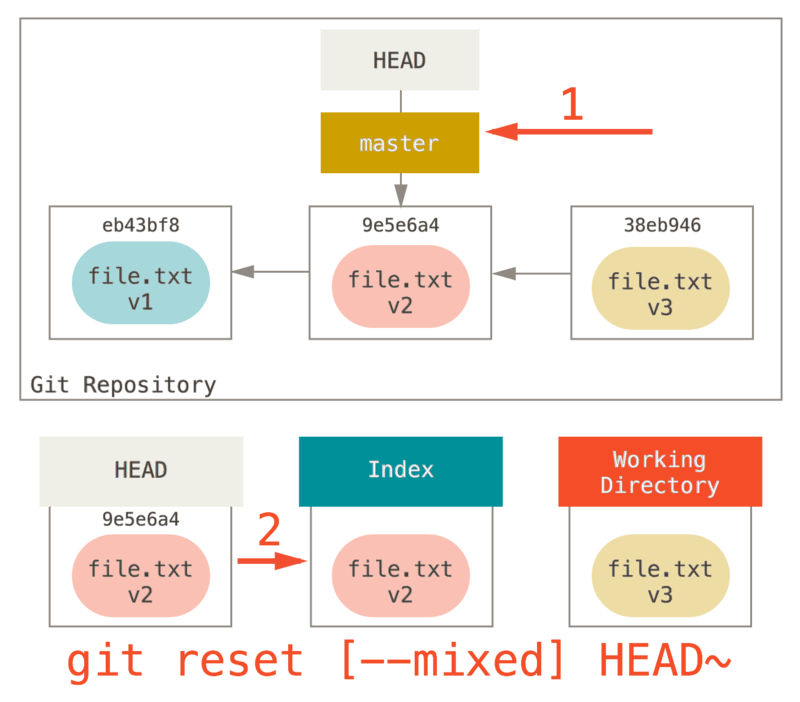

# Working With Git

## Repository

Kho lưu trữ Git là nơi lưu trữ ảo cho dự án của bạn. Nó cho phép bạn lưu các phiên bản mã của mình để bạn có thể truy cập khi cần

## Create new Repository

```shell
$ git init
```

Điều này tạo ra một thư mục con mới có tên .git chứa tất cả các tệp kho lưu trữ cần thiết của bạn – bộ khung Gitrepository. Tại thời điểm này, chưa có gì trong dự án của bạn được theo dõi.

## Clone an existing repository

Bạn sao chép một kho lưu trữ bằng git clone [url]. Ví dụ: nếu bạn muốn sao chép thư viện có thể liên kết Git có tên libgit2, bạn có thể làm như thế này

```shell
$ git clone https://github.com/libgit2/libgit2
```

```shell
git clone https://github.com/libgit2/libgit2 mylibgit
```

## Ignore

Các loại file mà muốn git không quan tâm nó thì set up trong `.gitignore`

```bash
# no .a files
*.a
# but do track lib.a, even though you're ignoring .a files above
!lib.a
# only ignore the TODO file in the current directory, not subdir/TODO
/TODO
# ignore all files in the build/ directory
build/
# ignore doc/notes.txt, but not doc/server/arch.txt
doc/*.txt
# ignore all .pdf files in the doc/ directory and any of its subdirectories
doc/**/*.pdf
```

## Commit

Bạn có thể nhập nội dung thông báo cam kết của mình bằng lệnh cam kết bằng cách chỉ định nó sau cờ a-m, như sau:

```shell
git commit -m "first commit"
```

Việc thêm tùy chọn `-a` vào lệnh git commit làm cho Git tự động stage mọi tệp đã được theo dõi trước khi thực hiện commit, cho phép bạn bỏ qua phần `git add`

## Remove

Lệnh `git rm` trong Git được sử dụng để xóa các tệp khỏi Index (staging area) từ thư mục làm việc (working directory). Nó thường được sử dụng khi bạn muốn xóa tệp khỏi dự án Git và đảm bảo rằng thay đổi này sẽ được ghi lại trong lịch sử của Git khi bạn thực hiện một lần commit.

Xóa tệp và thêm thay đổi vào Index:
```shell
git rm filename
```
Lệnh này sẽ xóa filename khỏi working directory và thêm việc xóa này vào Index, sẵn sàng để commit.

Chỉ xóa tệp khỏi Index nhưng giữ lại trong working directory:

```shell
git rm --cached filename
```

Lệnh này sẽ xóa filename khỏi Index nhưng giữ lại tệp trong working directory. Điều này hữu ích khi bạn muốn giữ tệp cục bộ nhưng không muốn nó được theo dõi bởi Git nữa.

Xóa thư mục và tất cả các tệp trong đó:

```shell
git rm -r foldername
```

Lệnh này sẽ xóa thư mục `foldername` và tất cả các tệp và thư mục con bên trong nó.

## Commit history

```shell
$ git log
$ git log -p -2
$ git log --stat
$ git log --pretty=oneline
$ git log --pretty=format:"%h %s" --graph
$ git log --since=2.weeks
$ git log -S function_name
$ git log --pretty="%h - %s" --author=gitster --since="2008-10-01" \--before="2008-11-01" --no-merges -- t/
```

## Undoing

### Unstaging a Staged File

Nếu bạn commit và sau đó nhận ra rằng bạn đã quên thực hiện các thay đổi trong tệp mà bạn muốn thêm vào commit này.

```shell
$ git commit -m 'initial commit'
$ git add forgotten_file
$ git commit --amend
```

### Putting back a Modified File

Điều gì sẽ xảy ra nếu bạn nhận ra rằng bạn không muốn giữ các thay đổi của mình đối với tệp `CONTRIBUTING.md`?

```shell
Changes not staged for commit:
  (use "git add <file>..." to update what will be committed)
  (use "git checkout -- <file>..." to discard changes in working directory)
    modified: CONTRIBUTING.md
```

Nó cho bạn biết khá rõ ràng cách loại bỏ những thay đổi bạn đã thực hiện. Hãy làm theo những gì nó nói:

```shell
$ git checkout -- CONTRIBUTING.md
$ git status
On branch master
Changes to be committed:
    (use "git reset HEAD <file>..." to unstage)

     renamed: README.md -> README
```

## Working with Remotes

Để có thể cộng tác trên bất kỳ dự án Git nào, bạn cần biết cách quản lý các kho lưu trữ từ xa của mình. Kho lưu trữ từ xa là các phiên bản của dự án của bạn được lưu trữ trên Internet hoặc mạng ở đâu đó. Bạn có thể có một vài trong số chúng, mỗi cái thường ở dạng chỉ đọc hoặc đọc/ghi đối với bạn.


```shell
# Showing Your Remotes
$ git remote -v
# Adding Remote Repositories
$ git remote add pb https://github.com/paulboone/ticgit
# Fetching and Pulling from Your Remotes
$ git fetch [remote-name]
# Pushing to Your Remotes
$ git push origin master
#Inspecting a Remote
$ git remote show origin
#Removing and Renaming Remotes
$ git remote rename pb paul
```

## Basic workflow

Git là trình quản lý nội dung của ba trees khác nhau. Khi nói “tree” ở đây nghĩa là “collection of files”, chứ không phải cụ thể là cấu trúc dữ liệu. (Có một số trường hợp trong đó chỉ mục không hoạt động chính xác như một cái cây, nhưng với mục đích của chúng ta, hiện tại, việc nghĩ về nó theo cách này sẽ dễ dàng hơn.)

Git là một hệ thống quản lý và thao tác three trees trong hoạt động bình thường của nó:

|Tree |	Role | |
|:---|:---|:---|
| HEAD  | Last commit snapshot, next parent | trỏ đến lần commit cuối cùng mà bạn đã thực hiện |
| Index | Proposed next commit snapshot |  hoạt động như một khu vực tổ chức |
| Working Directory | Sandbox | chứa các tệp thực tế |

**The HEAD**

HEAD là con trỏ tới tham chiếu nhánh hiện tại, lần lượt nó là con trỏ tới last commit được thực hiện trên nhánh đó. Điều đó có nghĩa là HEAD sẽ là parent của commit tiếp theo. Nhìn chung, cách đơn giản nhất là coi HEAD như snapshot cho last commit

```shell
$ git cat-file -p HEAD
tree cfda3bf379e4f8dba8717dee55aab78aef7f4daf
author Scott Chacon  1301511835 -0700
committer Scott Chacon  1301511835 -0700

initial commit

$ git ls-tree -r HEAD
100644 blob a906cb2a4a904a152...   README
100644 blob 8f94139338f9404f2...   Rakefile
040000 tree 99f1a6d12cb4b6f19...   lib
```

Lệnh cat-file và ls-tree là các lệnh “plumbing” được sử dụng cho những việc ở cấp độ thấp hơn và không thực sự được sử dụng trong công việc hàng ngày, nhưng chúng giúp chúng ta biết điều gì đang diễn ra ở đây.

**The Index**

The Index là proposed next commit. Khái niệm này là “Staging Area” của Git vì đây là những gì Git xem xét khi bạn chạy git commit.

```shell
$ git ls-files -s
100644 a906cb2a4a904a152e80877d4088654daad0c859 0	README
100644 8f94139338f9404f26296befa88755fc2598c289 0	Rakefile
100644 47c6340d6459e05787f644c2447d2595f5d3a54b 0	lib/simplegit.rb
```

Một lần nữa, ở đây chúng tôi đang sử dụng ls-files, đây giống như một lệnh hậu trường cho bạn biết chỉ mục của bạn hiện tại trông như thế nào.

Về mặt kỹ thuật, chỉ mục không phải là một cấu trúc cây – nó thực sự được triển khai dưới dạng một bảng kê khai được làm phẳng – nhưng đối với mục đích của chúng tôi thì nó đủ gần.

**The Working Directory**

Hãy coi Working Directory như một sandbox, nơi bạn có thể thử các thay đổi trước khi đưa chúng vào khu vực tổ chức (index) và sau đó vào lịch sử.

```shell
$ tree
.
├── README
├── Rakefile
└── lib
    └── simplegit.rb

1 directory, 3 files
```

# The Workflow

Mục đích chính của Git là ghi lại snapshots của dự án của bạn ở các trạng thái tốt hơn trong khoảng thời gian liên tiếp bằng cách thao tác với ba cây này.


**Let’s visualize this process**

Giả sử bạn đi vào một thư mục mới có một tệp duy nhất trong đó. Chúng tôi sẽ gọi đây là v1 của tệp và chúng tôi sẽ biểu thị nó bằng màu xanh lam. Bây giờ chúng tôi chạy `git init`, nó sẽ tạo một kho lưu trữ Git có tham chiếu HEAD trỏ đến một nhánh chưa sinh ra (master chưa tồn tại).


Tại thời điểm này, chỉ có cây Working Directory có nội dung.

Bây giờ chúng ta muốn commit file này nên chúng ta sử dụng `git add` để lấy nội dung trong Working Directory và sao chép nó vào Index.


Sau đó, chúng ta chạy `git commit`, lấy nội dung của Index và lưu nó dưới dạng snapshot vĩnh viễn, tạo một đối tượng trỏ đến snapshot đó và cập nhật bản gốc để trỏ đến snapshot đó.


Nếu chạy `git status`, chúng ta sẽ không thấy thay đổi nào vì cả ba cây đều giống nhau.

Bây giờ chúng ta muốn thực hiện thay đổi đối với tệp đó và commit. Chúng ta sẽ trải qua quá trình tương tự; đầu tiên chúng ta thay đổi tập tin trong working directory. Hãy gọi đây là v2 của tệp và biểu thị nó bằng màu đỏ.


Nếu chúng ta chạy `git status` ngay bây giờ, chúng ta sẽ thấy tệp màu đỏ là “Changes not staged for commit,” vì mục nhập đó khác nhau giữa Index và working directory. Tiếp theo, chúng ta chạy `git add` trên đó để đưa nó vào Index.


Tại thời điểm này, nếu chúng ta chạy `git status`, chúng ta sẽ thấy tệp có màu xanh lục trong phần “Changes to be committed” vì Index và HEAD khác nhau - nghĩa là, commit tiếp theo được đề xuất của chúng ta hiện khác với commit cuối. Cuối cùng, chúng ta chạy `git commit` để hoàn tất.


Bây giờ `git status` sẽ không cho chúng ta kết quả đầu ra vì cả ba cây đều giống nhau.

Việc chuyển nhánh hoặc nhân bản cũng trải qua một quá trình tương tự. Khi bạn kiểm tra một nhánh, nó sẽ thay đổi HEAD để trỏ đến tham chiếu nhánh mới, điền vào Index của bạn snapshot của commit đó, sau đó sao chép nội dung của Index vào Thư mục Working Directory.

## The Role of Reset

Giả sử chúng ta đã sửa đổi lại file.txt và commit nó lần thứ ba. Vì vậy, bây giờ lịch sử của chúng ta trông như thế này:


Bây giờ chúng ta sẽ tìm hiểu reset sẽ hoạt động như thế nào. Nó trực tiếp thao tác với ba cây này một cách đơn giản và có thể đoán trước được. Nó thực hiện ba thao tác cơ bản.

### Step 1: Move HEAD

Việc đầu tiên mà reset cần làm là điểm mà HEAD đang trỏ tới. Nó không phải việc thay đổi HEAD (không giống việc dùng lệnh checkout), nó chỉ đơn thuần là di chuyển HEAD. HEAD đang được đặt ở Master Branch, chạy `git reset 9e5e6a4` thì HEAD sẽ được đặt tới điểm `9e5e6a4`


Bất kể hình thức reset với commit nào thì đều thực hiện điều này đầu tiên. Với `reset --soft` thì việc reset chỉ dừng lại ở đây.

Bây giờ: về cơ bản nó đã hủy bỏ lệnh git commit cuối cùng. Khi bạn chạy `git commit`, Git tạo một commit mới và di chuyển nhánh mà HEAD trỏ tới nó. Khi bạn reset về `HEAD~`(the parent of HEAD) bạn sẽ di chuyển nhánh trở lại vị trí cũ mà không thay đổi Index hoặc Working directory. Bây giờ bạn có thể cập nhật Index và chạy lại `git commit` để hoàn thành

> Phần này giống `git commit --amend`

### Step 2: Updating the Index (--mixed)

Lưu ý rằng nếu bạn chạy `git status` bây giờ, bạn sẽ thấy màu xanh lục sự khác biệt giữa Index và HEAD mới là gì.

Việc tiếp theo mà reset làm là cập nhật Index với nội dung của bất kỳ snapshot nào mà HEAD hiện trỏ tới.



Nếu bạn sử dụng option `--mixed`, reset sẽ dừng lại ở việc này. Điều này cũng là mặc định (chỉ trong trường hợp sử dụng `git reset HEAD~`).

### Step 3: Updating the Working Directory (--hard)

Điều thứ ba mà việc reset sẽ làm là làm cho Working Directory trông giống như Index. Nếu bạn sử dụng tùy chọn `--hard`, nó sẽ tiếp tục đến giai đoạn này.


Option `--hard` này là một trong các cách nguy hiểm vì git thực sự phá dữ liệu. Bất kỳ yêu cầu đặt lại nào khác đều có thể được hoàn tác khá dễ dàng, nhưng tùy chọn --hard thì không thể, vì nó buộc phải ghi đè lên các tệp trong Working Directory. 

### Recap

The reset command overwrites these three trees in a specific order, stopping when you tell it to:

- Move the branch HEAD points to (stop here if --soft)

- Make the Index look like HEAD (stop here unless --hard)

- Make the Working Directory look like the Index

## Tagging

Giống như hầu hết các VCS, Git có khả năng gắn thẻ các điểm cụ thể trong lịch sử là quan trọng. Thông thường, mọi người sử dụng chức năng này để đánh dấu các điểm phát hành (v1.0, v.v.). Trong phần này, bạn sẽ tìm hiểu cách liệt kê các thẻ có sẵn, cách tạo thẻ mới và các loại thẻ khác nhau.


```shell
# Listing Your Tags
$ git tag
# Annotated Tags
$ git tag -a v1.4 -m "my version 1.4"
# Lightweight Tags
$ git tag v1.4-lw
# Tagging Later
$ git tag -a v1.2 9fceb02
$ git show v1.2
# Sharing Tags
$ git push origin --tags
# Checking out Tags
$ git checkout -b version2 v2.0.0
```

## Aliases

Có một mẹo nhỏ có thể giúp trải nghiệm Git của bạn đơn giản hơn, dễ dàng hơn và quen thuộc hơn: Aliases

Ví dụ bạn có thể muốn thiết lập

Bạn có thể thêm bí danh chưa được phân loại của riêng mình vào Git

```shell
$ git config --global alias.co checkout
$ git config --global alias.br branch
$ git config --global alias.ci commit
$ git config --global alias.st status
```

Điều này làm cho hai lệnh sau tương đương

```shell
$ git config --global alias.unstage 'reset HEAD --'
```

```shell
$ git unstage fileA
$ git reset HEAD -- fileA
```